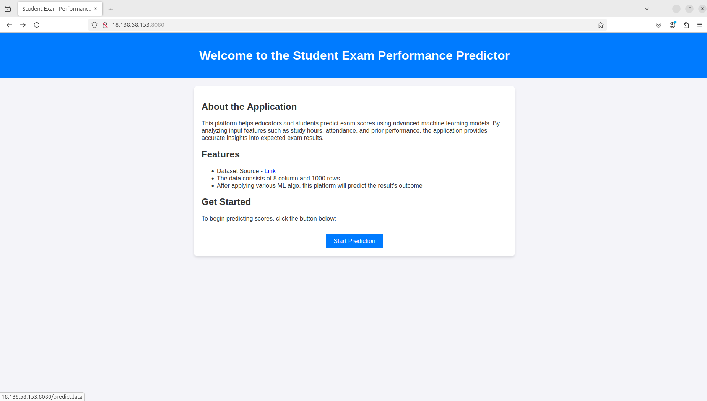
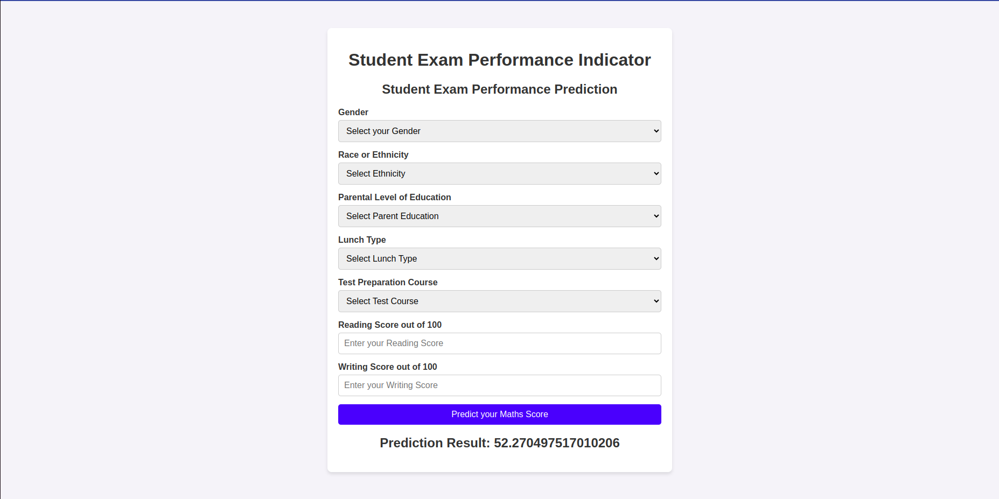

# **Student Performance App**

A web application designed to analyze and visualize student performance data. This project incorporates modern software development practices, including CI/CD pipelines, containerization, and cloud deployment, ensuring robust and scalable performance.

---

## **Features**
- **Data Analysis**: Perform exploratory data analysis on student performance datasets.
- **Customizable Metrics**: Filter and analyze performance based on parameters like grades, demographics, or attendance.
- **Web Interface**: User-friendly web application built with Flask.
- **MLOps**: Emphasizes the use of CI/CD and Docker as modern development practices

---

## **Technology Stack**
- **Backend**: Flask (Python)
- **Containerization**: Docker
- **Cloud Deployment**: AWS EC2, Amazon ECR
- **Data Visualization**: Matplotlib, Plotly, or Seaborn
- **CI/CD**: GitHub Actions

---

## **CI/CD Pipeline**
The project implements an automated CI/CD pipeline using GitHub Actions:

1. **Continuous Integration**:
   - Automatically builds the Docker image on each commit or pull request.
   - Runs unit tests to ensure code quality and prevent regressions.
   - Checks for linting errors to maintain consistent coding standards.

2. **Continuous Deployment**:
   - Pushes the built Docker image to Amazon Elastic Container Registry (ECR).
   - Connects to the EC2 instance, pulls the latest Docker image, and deploys the app.
   - Automatically restarts the container to reflect updates seamlessly.

3. **Pipeline Steps**:
   - **Docker System Cleanup**: Frees up space by pruning unused Docker resources.
   - **Disk Space Monitoring**: Ensures sufficient space before building or deploying.
   - **Build and Test**: Creates and verifies the Docker image locally.
   - **Deployment**: Automates the push to ECR and pull from EC2.

This pipeline ensures faster iteration, consistent deployment processes, and minimal downtime.


---
## Docker Setup on EC2

This section guides you through setting up Docker on an Amazon EC2 instance for deploying your student performance application.

**Prerequisites**

- An AWS account with an EC2 instance running Ubuntu.
- Basic familiarity with the AWS Management Console and command line.

**Steps**

1. Update and Upgrade Packages (Optional)

   ```bash
   sudo apt-get update -y
   sudo apt-get upgrade -y
2. Install Docker
    ```bash
    curl -fsSL [https://get.docker.com](https://get.docker.com) -o get-docker.sh
    sudo sh get-docker.sh
3. Add User to Docker Group
    ```bash
    sudo usermod -aG docker ubuntu
4. Verify Docker Installation
    ```bash
    docker run hello-world
---

## **Getting started Locally**
1. Clone the repository:
   ```bash
   git clone https://github.com/adlirazin7/mlproject.git
   cd ./mlproject
2. Build and run the Docker container locally:
    ```bash
    docker build -t student-performance-app .
    docker run -p 8080:8080 student-performance-app
3. Run the application.py
4. Access the app in your browser at http://localhost:8080


---
## **Screenshots Project**
**Index Page**
 

**Result Page**
 


- **Credits:**
    * Machine Learning Project completed during the End-to-End Machine Learning Bootcamp by Kirsh Naik. 


